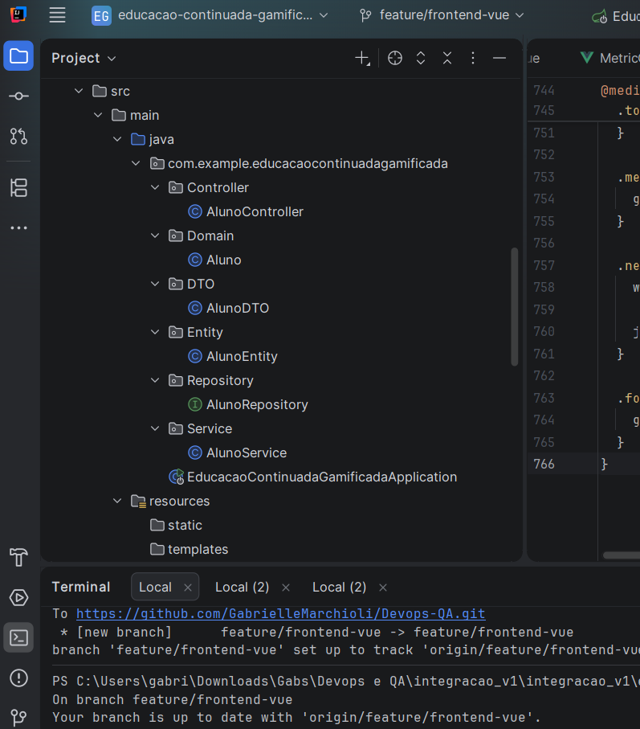
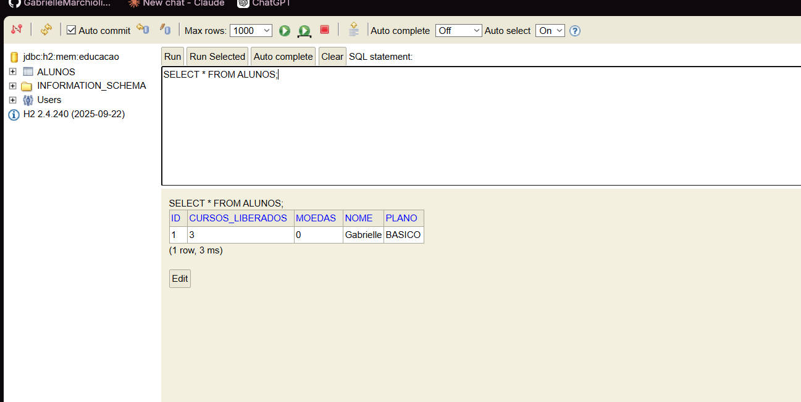
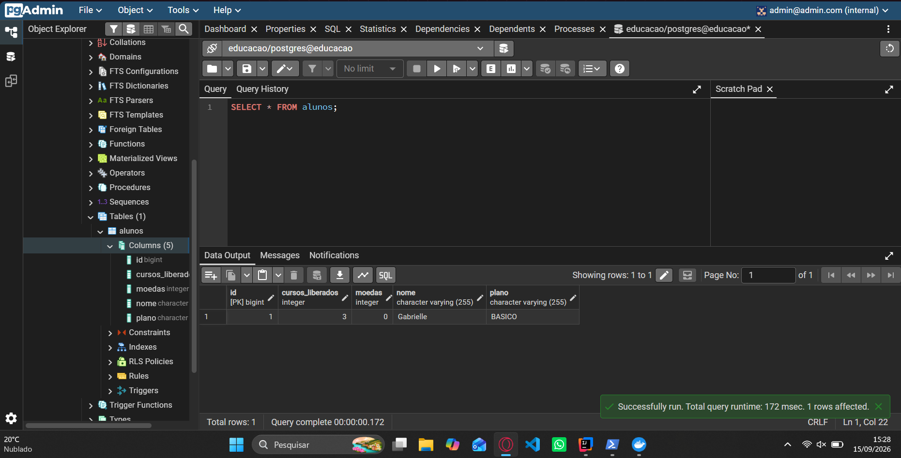
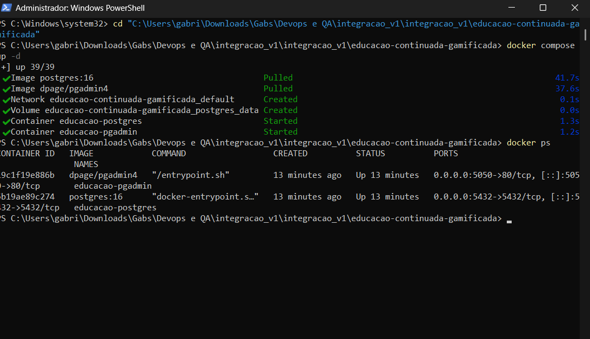
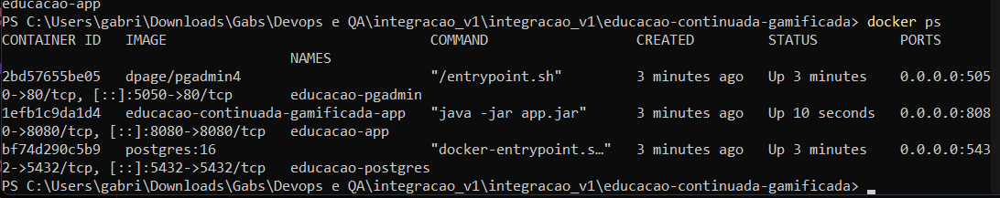
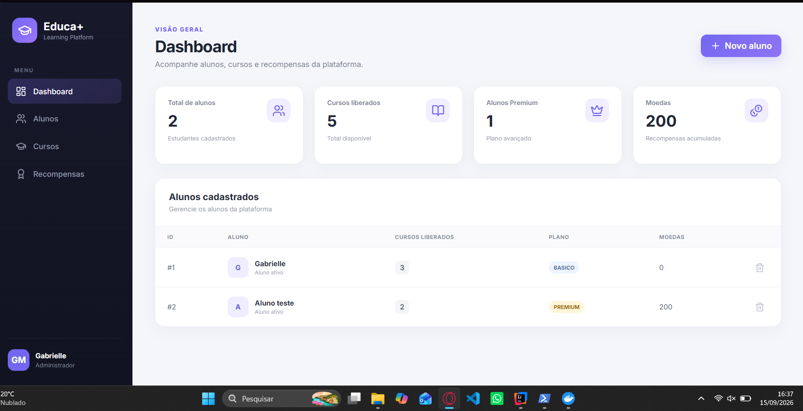
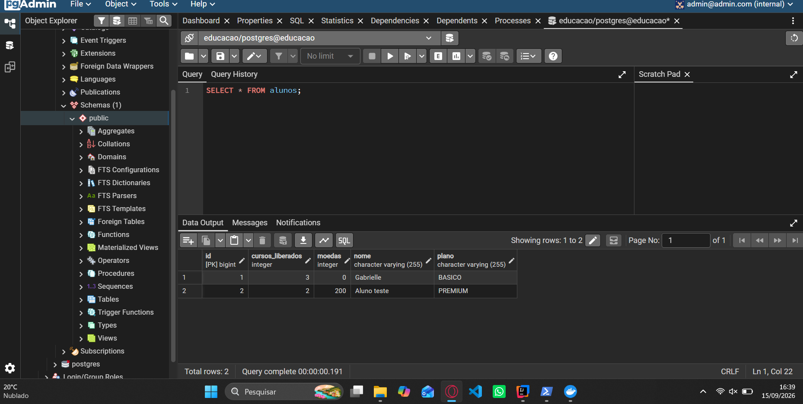

# Educação Continuada Gamificada — ATDD, BDD e TDD

**Disciplina:** DevOps & QA  

## Integrantes

- Afonso Henrique C. de Oliveira
- Gabrielle Amaro Marchioli
- Giulianno Giacianni Gonçalves

---

# 1. Descrição do estudo de caso

Uma plataforma de educação continuada oferece cursos online e EAD através de um modelo de assinaturas.

O aluno paga um valor mensal e possui acesso a um conjunto de cursos da assinatura básica.

As regras de gamificação do sistema são:

- Ao concluir um curso com média acima de 7,0, o aluno recebe direito a realizar mais 3 cursos.
- O aluno que escrever mais tópicos no fórum e ajudar outros participantes através de comentários recebe um curso adicional ao final do mês.
- Quando o aluno conquistar 12 cursos, seu plano de assinatura passa a ser **Premium**.
- Ao se tornar Premium, o aluno passa a receber vouchers para participar de projetos reais.
- O aluno Premium também recebe 3 moedas, que podem ser acumuladas ou convertidas conforme as regras da plataforma.

---

# 2. User Stories

Cada integrante da equipe definiu uma User Story relacionada ao estudo de caso.

## US01 — Gabrielle Amaro Marchioli

**EU COMO** aluno da plataforma  
**QUERO** receber acesso a três novos cursos quando concluir um curso com média acima de 7,0  
**PARA** continuar minha educação e ser recompensado pelo meu desempenho.

**Prioridade:** Essencial

---

## US02 — Afonso Henrique C. de Oliveira

**EU COMO** aluno participante do fórum  
**QUERO** receber um curso adicional quando tiver o maior engajamento e colaboração no mês  
**PARA** ser recompensado pela minha participação e ajuda aos outros alunos.

**Prioridade:** Importante

---

## US03 — Giulianno Giacianni Gonçalves

**EU COMO** aluno da plataforma  
**QUERO** ter meu plano alterado para Premium ao conquistar 12 cursos  
**PARA** receber acesso aos benefícios Premium, como vouchers para projetos reais e moedas.

**Prioridade:** Desejável

---

# 3. User Story escolhida para implementação

A User Story escolhida pelo grupo para implementação foi:

## US01 — Liberação de três novos cursos

**EU COMO** aluno da plataforma  
**QUERO** receber acesso a três novos cursos quando concluir um curso com média acima de 7,0  
**PARA** continuar minha educação e ser recompensado pelo meu desempenho.

Essa User Story foi escolhida por representar uma regra objetiva do sistema e permitir a criação de diferentes cenários BDD para validação.

---

# 4. BDDs definidos pela equipe

Cada integrante criou um cenário BDD relacionado à User Story escolhida.

---

## BDD — Gabrielle Amaro Marchioli

**Dado que** o aluno concluiu um curso  
**E** obteve média 8,0  
**Quando** o sistema avaliar seu desempenho  
**Então** deverão ser liberados três novos cursos.

---

## BDD — Afonso Henrique C. de Oliveira

**Dado que** o aluno concluiu um curso  
**E** obteve média exatamente 7,0  
**Quando** o sistema avaliar seu desempenho  
**Então** nenhum novo curso deverá ser liberado.

---

## BDD — Giulianno Giacianni Gonçalves

**Dado que** o aluno concluiu um curso  
**E** obteve média inferior a 7,0  
**Quando** o sistema avaliar seu desempenho  
**Então** nenhum novo curso deverá ser liberado.

---

# 5. Tecnologias utilizadas

| Tecnologia | Finalidade |
|---|---|
| Java 17 | Linguagem de programação |
| Spring Boot | Framework principal |
| Spring Web | Estrutura web da aplicação |
| Spring Data JPA | Persistência e acesso a dados |
| H2 Database | Banco em memória para desenvolvimento/testes |
| PostgreSQL | Banco de dados relacional |
| JUnit 5 | Testes automatizados |
| JaCoCo | Cobertura de testes |
| Maven | Gerenciamento de dependências e build |
| IntelliJ IDEA Ultimate | Ambiente de desenvolvimento |
| Git | Controle de versão |
| GitHub | Repositório compartilhado |

---

# 6. Estrutura principal do projeto

```text
educacao-continuada-gamificada/
│
├── pom.xml
├── mvnw
├── mvnw.cmd
│
├── src/
│   │
│   ├── main/
│   │   ├── java/
│   │   │   └── com/example/educacaocontinuadagamificada/
│   │   │       ├── EducacaoContinuadaGamificadaApplication.java
│   │   │       └── Domain/
│   │   │           └── Aluno.java
│   │   │
│   │   └── resources/
│   │       └── application.properties
│   │
│   └── test/
│       └── java/
│           └── com/example/educacaocontinuadagamificada/
│               └── DomainTest/
│                   └── AlunoTest.java
│
└── target/
    └── site/
        └── jacoco/
            └── index.html
```

---

# 7. TDD — Etapa RED

Na etapa RED, o teste é criado antes da implementação completa da regra de negócio.

O método inicialmente não libera nenhum curso:

```java
public void avaliarConclusaoCurso(double media) {
    // Stub para etapa RED
}
```

Teste criado:

```java
@Test
public void deveLiberarTresCursosQuandoMediaForMaiorQueSete() {

    // Arrange
    Aluno aluno = new Aluno("Gabrielle");

    // Action
    aluno.avaliarConclusaoCurso(8.0);

    // Assert
    assertEquals(
            3,
            aluno.getCursosLiberados()
    );
}
```

Resultado esperado:

```text
Expected: 3
Actual: 0
```

O teste falhou conforme esperado, caracterizando a etapa RED.

## Evidência — RED


---

# 8. TDD — Etapa GREEN

Na etapa GREEN, foi implementada a regra mínima necessária para fazer o teste passar.

```java
public void avaliarConclusaoCurso(double media) {

    if (media > 7.0) {
        cursosLiberados += 3;
    }
}
```

Após a implementação, o teste da Gabrielle passou com sucesso.

## Evidência — GREEN Gabrielle


---

# 9. TDD — Etapa BLUE / REFACTOR

Após todos os BDDs e testes estarem implementados, foi realizada a etapa BLUE.

O objetivo da refatoração é melhorar a legibilidade e a manutenção do código sem alterar seu comportamento.

Código refatorado:

```java
package com.example.educacaocontinuadagamificada.Domain;

public class Aluno {

    private static final double MEDIA_MINIMA_BONUS = 7.0;
    private static final int CURSOS_BONUS = 3;

    private String nome;
    private int cursosLiberados;

    public Aluno(String nome) {
        this.nome = nome;
        this.cursosLiberados = 0;
    }

    public void avaliarConclusaoCurso(double media) {

        if (media > MEDIA_MINIMA_BONUS) {
            cursosLiberados += CURSOS_BONUS;
        }
    }

    public String getNome() {
        return nome;
    }

    public int getCursosLiberados() {
        return cursosLiberados;
    }
}
```

A alteração substituiu valores numéricos diretamente no código por constantes:

```java
private static final double MEDIA_MINIMA_BONUS = 7.0;
private static final int CURSOS_BONUS = 3;
```

Isso torna a regra mais clara e facilita futuras alterações.

## Evidência — BLUE


---

# 10. Execução dos testes

Os testes podem ser executados utilizando o Maven Wrapper.

No Windows:

```powershell
.\mvnw.cmd test
```

Resultado esperado:

```text
Tests run: ...
Failures: 0
Errors: 0
Skipped: 0

BUILD SUCCESS
```

## Evidência — Maven


---

# 11. Cobertura com JaCoCo

Para executar os testes e gerar o relatório de cobertura:

```powershell
.\mvnw.cmd clean verify
```

O relatório é gerado no caminho:

```text
target/site/jacoco/index.html
```

O JaCoCo permite analisar:

- Instructions
- Branches
- Lines
- Methods
- Classes
- Complexidade ciclomática

---

# 12. Cobertura final — BLUE

Após a inclusão dos BDDs de todos os integrantes e a refatoração do código, os testes devem cobrir todos os caminhos da classe de domínio.

O objetivo final é:

```text
Instructions: 100%
Branches: 100%
Lines: 100%
Methods: 100%
Classes: 100%
```

Sem linhas amarelas ou vermelhas.

## Evidência — JaCoCo 100%


---

# 13. Participação dos integrantes no GitHub

O projeto foi desenvolvido de forma colaborativa no mesmo repositório.

Cada integrante realizou commits referentes à própria contribuição.

## Gabrielle

Responsável por:

- User Story;
- BDD com média 8,0;
- teste RED;
- implementação GREEN inicial.

## Afonso

Responsável por:

- BDD com média exatamente 7,0;
- teste automatizado correspondente.

## Giulianno

Responsável por:

- BDD com média inferior a 7,0;
- teste automatizado correspondente.

---

# 14. Fluxo ATDD aplicado

O fluxo da atividade foi:

```text
ESTUDO DE CASO
      ↓
USER STORIES
      ↓
ESCOLHA DE UMA USER STORY
      ↓
BDD DE CADA INTEGRANTE
      ↓
TDD
      ↓
RED
Teste falhando
      ↓
GREEN
Teste passando
      ↓
BLUE / REFACTOR
Código melhorado
      ↓
JACOCO
Cobertura 100%
      ↓
GITHUB
Projeto colaborativo
```

---

# 15. Implementação das camadas da aplicação

Após a conclusão das etapas de BDD, TDD e cobertura de testes, foram implementadas as demais camadas da aplicação Spring Boot.

A estrutura foi organizada em:

```text
src/main/java/com/example/educacaocontinuadagamificada/
│
├── Domain/
│   └── Aluno.java
│
├── Entity/
│   └── AlunoEntity.java
│
├── Repository/
│   └── AlunoRepository.java
│
├── DTO/
│   └── AlunoDTO.java
│
├── Service/
│   └── AlunoService.java
│
├── Controller/
│   └── AlunoController.java
│
└── EducacaoContinuadaGamificadaApplication.java
```

As responsabilidades foram divididas da seguinte forma:

- **Domain:** contém a regra de negócio utilizada durante o TDD.
- **Entity:** representa a tabela de alunos no banco de dados.
- **Repository:** realiza a persistência utilizando Spring Data JPA.
- **DTO:** transporta os dados entre as camadas.
- **Service:** concentra a lógica de acesso e manipulação dos dados.
- **Controller:** expõe os endpoints REST da aplicação.

## Evidência — Estrutura das camadas

<!-- Adicionar imagem da estrutura de pacotes no IntelliJ -->



---

# 16. API REST

A aplicação disponibiliza uma API REST para gerenciamento dos alunos.

O endpoint principal utilizado é:

```text
/api/alunos
```

Foram implementadas as seguintes operações:

| Método HTTP | Endpoint | Função |
|---|---|---|
| POST | `/api/alunos` | Cadastrar aluno |
| GET | `/api/alunos` | Listar todos os alunos |
| GET | `/api/alunos/{id}` | Buscar aluno por ID |
| DELETE | `/api/alunos/{id}` | Excluir aluno |

A API utiliza a seguinte sequência de camadas:

```text
Controller
   ↓
Service
   ↓
Repository
   ↓
Banco de dados
```

---

# 17. Documentação da API com Swagger

A API foi documentada utilizando Swagger/OpenAPI.

Com a aplicação em execução, a interface pode ser acessada em:

```text
http://localhost:8080/swagger-ui/index.html
```

Por meio do Swagger é possível visualizar e testar os endpoints diretamente pelo navegador.

Foi realizado um teste de cadastro utilizando o endpoint:

```text
POST /api/alunos
```

Exemplo de requisição:

```json
{
  "nome": "Gabrielle",
  "cursosLiberados": 3,
  "plano": "BASICO",
  "moedas": 0
}
```
---

# 18. Banco de dados H2

O projeto também foi configurado para utilizar o banco H2 em memória.

A configuração permite executar e testar a aplicação sem a necessidade de um banco de dados externo.

O console do H2 pode ser acessado através de:

```text
http://localhost:8080/h2-console
```

Configuração utilizada:

```text
JDBC URL: jdbc:h2:mem:educacao
User Name: sa
Password:
```

Durante os testes, a tabela `ALUNOS` foi criada e os dados puderam ser consultados diretamente pelo console H2.

A consulta utilizada foi:

```sql
SELECT * FROM ALUNOS;
```

## Evidência — H2



---

# 19. PostgreSQL

Além do H2, a aplicação também foi configurada para utilizar PostgreSQL.

Foi criado um perfil específico de configuração:

```text
application-postgres.properties
```

Configuração principal:

```properties
spring.datasource.url=jdbc:postgresql://localhost:5432/educacao
spring.datasource.username=postgres
spring.datasource.password=postgres
spring.datasource.driver-class-name=org.postgresql.Driver

spring.jpa.hibernate.ddl-auto=update
spring.jpa.show-sql=true
```

A aplicação pode ser iniciada utilizando o perfil PostgreSQL através do Maven:

```powershell
.\mvnw.cmd spring-boot:run "-Dspring-boot.run.profiles=postgres"
```

Durante a execução, o Spring Boot conecta-se ao PostgreSQL utilizando o driver JDBC do PostgreSQL.

O JPA/Hibernate é responsável pela criação e atualização da tabela:

```text
alunos
```

# 20. pgAdmin

O pgAdmin foi utilizado como interface gráfica para gerenciamento e consulta do PostgreSQL.

A interface foi disponibilizada em:

```text
http://localhost:5050
```

Dados utilizados para acesso ao pgAdmin:

```text
Email: admin@admin.com
Senha: admin
```

O servidor PostgreSQL foi registrado no pgAdmin com as seguintes configurações:

```text
Host: postgres
Port: 5432
Database: educacao
Username: postgres
Password: postgres
```

A tabela `alunos` foi consultada utilizando:

```sql
SELECT * FROM alunos;
```

A consulta permitiu verificar os registros persistidos pela aplicação Spring Boot.

## Evidência — PostgreSQL no pgAdmin



---

# 21. Docker

O projeto utiliza Docker para executar os serviços necessários da aplicação.

Foi criado um arquivo:

```text
Dockerfile
```

responsável por gerar a imagem da aplicação Spring Boot.

Também foi criado:

```text
docker-compose.yml
```

para executar os serviços de forma integrada.

Os principais containers utilizados são:

```text
educacao-app
educacao-postgres
educacao-pgadmin
```

A aplicação pode ser executada utilizando:

```powershell
docker compose up --build
```

Também é possível executar os containers em segundo plano:

```powershell
docker compose up -d
```

Para verificar os containers em execução:

```powershell
docker ps
```

As portas utilizadas são:

| Serviço | Porta |
|---|---|
| Spring Boot | 8080 |
| PostgreSQL | 5432 |
| pgAdmin | 5050 |

## Evidência — PostgreSQL e pgAdmin executando no Docker



## Evidência — Aplicação, PostgreSQL e pgAdmin no Docker



Essa evidência demonstra os três serviços executando simultaneamente:

```text
educacao-app
educacao-postgres
educacao-pgadmin
```

---

# 22. Frontend em VueJS

Foi desenvolvido um frontend utilizando **Vue 3 + Vite** para consumir a API REST criada com Spring Boot.

O frontend foi organizado na pasta:

```text
frontend/
```

Estrutura principal:

```text
frontend/
│
├── src/
│   ├── components/
│   │   ├── Sidebar.vue
│   │   ├── MetricCard.vue
│   │   ├── StudentsTable.vue
│   │   └── StudentModal.vue
│   │
│   ├── services/
│   │   └── alunoService.js
│   │
│   ├── App.vue
│   ├── main.js
│   └── style.css
│
├── package.json
├── index.html
└── vite.config.js
```

O frontend possui um dashboard para gerenciamento dos alunos da plataforma.

Entre as informações exibidas estão:

- total de alunos cadastrados;
- total de cursos liberados;
- quantidade de alunos Premium;
- quantidade total de moedas;
- listagem dos alunos;
- plano de cada aluno;
- quantidade de cursos liberados;
- quantidade de moedas.

Também foi implementado um formulário para cadastro de novos alunos.

## Evidência — Dashboard VueJS



---

# 23. Integração VueJS com Spring Boot

O frontend VueJS consome diretamente a API REST do Spring Boot.

A comunicação é realizada através do endpoint:

```text
/api/alunos
```

As principais operações utilizadas pelo frontend são:

```text
GET /api/alunos
POST /api/alunos
DELETE /api/alunos/{id}
```

O frontend utiliza a Fetch API para realizar as requisições.

Fluxo de cadastro:

```text
VueJS
   ↓
POST /api/alunos
   ↓
Spring Boot Controller
   ↓
Service
   ↓
Repository JPA
   ↓
PostgreSQL
```

Após o cadastro de um novo aluno pelo frontend, o dashboard é atualizado automaticamente com os dados retornados pela API.

## Evidência — Cadastro no VueJS

<!-- Adicionar print do modal de cadastro ou do aluno recém-criado no dashboard -->


---

# 24. Persistência VueJS → PostgreSQL

Foi realizado um teste completo de integração entre o frontend e o banco de dados.

Um aluno foi cadastrado diretamente pela interface VueJS.

Após o cadastro, o registro foi consultado no PostgreSQL através do pgAdmin.

A consulta utilizada foi:

```sql
SELECT * FROM alunos;
```

O aluno criado pelo frontend foi encontrado corretamente na tabela `alunos`, comprovando a persistência dos dados.

Fluxo validado:

```text
Frontend VueJS
      ↓
API Spring Boot
      ↓
Spring Data JPA
      ↓
PostgreSQL
      ↓
pgAdmin
```

## Evidência — Registro criado pelo VueJS no PostgreSQL



---

# 25. Arquitetura final da aplicação

A arquitetura final do projeto pode ser representada da seguinte forma:

```text
VueJS
   │
   │ HTTP / REST
   ▼
Spring Boot
   │
   ├── Controller
   │
   ├── Service
   │
   ├── Repository
   │
   ├── DTO
   │
   └── Entity
   │
   ▼
PostgreSQL
```

Durante o desenvolvimento e testes também foi utilizado o banco H2:

```text
Spring Boot
   │
   ├── H2 Database
   │
   └── PostgreSQL
```

Os serviços principais também podem ser executados através do Docker Compose:

```text
Docker Compose
│
├── educacao-app
├── educacao-postgres
└── educacao-pgadmin
```

---

# 26. Execução do projeto

## Backend com H2

Para executar utilizando H2:

```powershell
.\mvnw.cmd spring-boot:run
```

---

## Backend com PostgreSQL

Para executar utilizando PostgreSQL:

```powershell
.\mvnw.cmd spring-boot:run "-Dspring-boot.run.profiles=postgres"
```

---

## Docker

Para executar PostgreSQL, pgAdmin e aplicação Spring Boot:

```powershell
docker compose up --build
```

Também é possível utilizar:

```powershell
docker compose up -d
```

---

## Frontend VueJS

Acesse a pasta:

```powershell
cd frontend
```

Instale as dependências:

```powershell
npm install
```

Execute:

```powershell
npm run dev
```

O frontend será disponibilizado pelo Vite, normalmente em:

```text
http://localhost:5173
```

---

# 27. Evidências finais da aplicação

As principais evidências do projeto são:

| Evidência | Arquivo |
|---|---|
| TDD RED | `docs/red.png` |
| TDD GREEN | `docs/green.png` |
| TDD BLUE | `docs/blue.png` |
| Maven BUILD SUCCESS | `docs/maven-build-success.png` |
| JaCoCo 100% | `docs/jacoco-100.png` |
| Estrutura em camadas | `docs/estrutura-camadas.png` |
| Swagger | `docs/swagger.png` |
| Swagger via Docker | `docs/swagger-docker.png` |
| Banco H2 | `docs/h2-banco.png` |
| PostgreSQL / pgAdmin | `docs/postgres-pgadmin.png` |
| Spring conectado ao PostgreSQL | `docs/spring-postgres.png` |
| Docker PostgreSQL + pgAdmin | `docs/docker-containers.png` |
| Docker aplicação completa | `docs/docker-app-postgres-pgadmin.png` |
| Dashboard VueJS | `docs/vue-dashboard.png` |
| Cadastro VueJS | `docs/vue-cadastro.png` |
| VueJS → PostgreSQL | `docs/vue-postgres.png` |

---

# 28. Fluxo completo da aplicação

O fluxo completo da aplicação pode ser representado da seguinte forma:

```text
Usuário
   ↓
Frontend VueJS
   ↓
API REST
   ↓
Controller
   ↓
Service
   ↓
Repository
   ↓
Spring Data JPA
   ↓
PostgreSQL
   ↓
pgAdmin
```

Durante o desenvolvimento também foi utilizado:

```text
Spring Boot
   ↓
H2 Database
```

A aplicação também pode ser executada por meio do Docker:

```text
Docker Compose
│
├── educacao-app
│   └── Spring Boot
│
├── educacao-postgres
│   └── PostgreSQL
│
└── educacao-pgadmin
    └── pgAdmin
```

---

# 29. Tecnologias adicionais utilizadas

Além das tecnologias utilizadas nas etapas de BDD e TDD, o projeto também utiliza:

| Tecnologia | Finalidade |
|---|---|
| Swagger / OpenAPI | Documentação e testes da API |
| Docker | Containerização da aplicação |
| Docker Compose | Orquestração dos containers |
| pgAdmin | Administração visual do PostgreSQL |
| Vue 3 | Desenvolvimento do frontend |
| Vite | Ferramenta de desenvolvimento e build do frontend |
| Fetch API | Comunicação entre VueJS e Spring Boot |

---

# 30. Conclusão

A atividade permitiu aplicar de forma prática o processo de **ATDD**, combinando User Stories, BDD e TDD.

A partir do estudo de caso de Educação Continuada Gamificada, cada integrante criou uma User Story.

Uma das histórias foi selecionada pelo grupo e transformada em diferentes cenários BDD.

Os cenários foram utilizados como base para os testes automatizados.

O desenvolvimento seguiu o ciclo:

```text
RED → GREEN → BLUE
```

Na etapa RED, os testes foram escritos antes da implementação e apresentaram falha.

Na etapa GREEN, a regra necessária foi implementada para permitir que os testes passassem.

Na etapa BLUE, o código foi refatorado mantendo todos os testes funcionando.

Por fim, o JaCoCo foi utilizado para verificar a cobertura do código e garantir que os diferentes caminhos da regra de negócio fossem exercitados pelos testes.

Além da aplicação das práticas de **ATDD, BDD e TDD**, o projeto foi evoluído para uma aplicação completa utilizando arquitetura em camadas.

Foram implementados:

- domínio e regras de negócio;
- testes automatizados;
- fluxo RED, GREEN e BLUE;
- cobertura de código com JaCoCo;
- API REST utilizando Spring Boot;
- arquitetura com Entity, Repository, DTO, Service e Controller;
- persistência utilizando Spring Data JPA;
- banco H2;
- banco PostgreSQL;
- gerenciamento do PostgreSQL através do pgAdmin;
- documentação e testes da API com Swagger;
- execução utilizando Docker;
- orquestração utilizando Docker Compose;
- frontend desenvolvido em VueJS;
- dashboard para visualização dos alunos;
- cadastro de alunos pelo frontend;
- exclusão de alunos;
- integração entre VueJS e Spring Boot;
- persistência dos registros criados no VueJS diretamente no PostgreSQL.

A integração final validada foi:

```text
VueJS
   ↓
Spring Boot
   ↓
Spring Data JPA
   ↓
PostgreSQL
```

O projeto demonstra a aplicação das práticas de qualidade de software desde a definição dos requisitos e cenários BDD até a implementação, testes automatizados, persistência, containerização e construção de uma interface frontend integrada.
