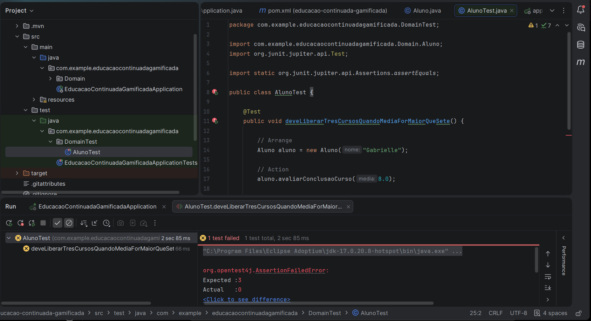
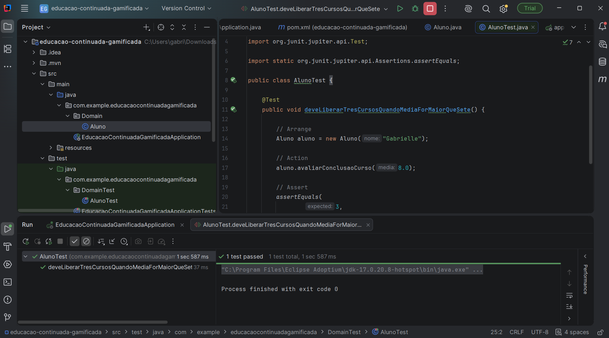
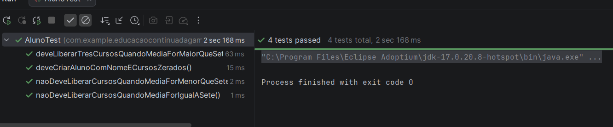
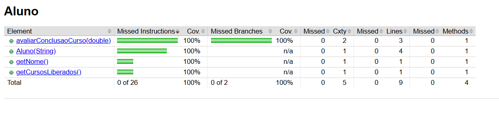

# Educação Continuada Gamificada — ATDD, BDD e TDD

**Disciplina:** DevOps & QA  

## Integrantes

- Afonso Henrique C. de Oliveira
- Gabrielle Amaro Marchioli
- Giulianno Giacianni Gonçalves

---

# 1. Descrição do estudo de caso

Uma plataforma de educação continuada oferece cursos online e EAD através de um modelo de assinaturas.

O aluno paga um valor mensal e possui acesso a um conjunto de cursos da assinatura básica.

As regras de gamificação do sistema são:

- Ao concluir um curso com média acima de 7,0, o aluno recebe direito a realizar mais 3 cursos.
- O aluno que escrever mais tópicos no fórum e ajudar outros participantes através de comentários recebe um curso adicional ao final do mês.
- Quando o aluno conquistar 12 cursos, seu plano de assinatura passa a ser **Premium**.
- Ao se tornar Premium, o aluno passa a receber vouchers para participar de projetos reais.
- O aluno Premium também recebe 3 moedas, que podem ser acumuladas ou convertidas conforme as regras da plataforma.

---

# 2. User Stories

Cada integrante da equipe definiu uma User Story relacionada ao estudo de caso.

## US01 — Gabrielle Amaro Marchioli

**EU COMO** aluno da plataforma  
**QUERO** receber acesso a três novos cursos quando concluir um curso com média acima de 7,0  
**PARA** continuar minha educação e ser recompensado pelo meu desempenho.

**Prioridade:** Essencial

---

## US02 — Afonso Henrique C. de Oliveira

**EU COMO** aluno participante do fórum  
**QUERO** receber um curso adicional quando tiver o maior engajamento e colaboração no mês  
**PARA** ser recompensado pela minha participação e ajuda aos outros alunos.

**Prioridade:** Importante

---

## US03 — Giulianno Giacianni Gonçalves

**EU COMO** aluno da plataforma  
**QUERO** ter meu plano alterado para Premium ao conquistar 12 cursos  
**PARA** receber acesso aos benefícios Premium, como vouchers para projetos reais e moedas.

**Prioridade:** Desejável

---

# 3. User Story escolhida para implementação

A User Story escolhida pelo grupo para implementação foi:

## US01 — Liberação de três novos cursos

**EU COMO** aluno da plataforma  
**QUERO** receber acesso a três novos cursos quando concluir um curso com média acima de 7,0  
**PARA** continuar minha educação e ser recompensado pelo meu desempenho.

Essa User Story foi escolhida por representar uma regra objetiva do sistema e permitir a criação de diferentes cenários BDD para validação.

---

# 4. BDDs definidos pela equipe

Cada integrante criou um cenário BDD relacionado à User Story escolhida.

---

## BDD — Gabrielle Amaro Marchioli

**Dado que** o aluno concluiu um curso  
**E** obteve média 8,0  
**Quando** o sistema avaliar seu desempenho  
**Então** deverão ser liberados três novos cursos.

---

## BDD — Afonso Henrique C. de Oliveira

**Dado que** o aluno concluiu um curso  
**E** obteve média exatamente 7,0  
**Quando** o sistema avaliar seu desempenho  
**Então** nenhum novo curso deverá ser liberado.

---

## BDD — Giulianno Giacianni Gonçalves

**Dado que** o aluno concluiu um curso  
**E** obteve média inferior a 7,0  
**Quando** o sistema avaliar seu desempenho  
**Então** nenhum novo curso deverá ser liberado.

---

# 5. Tecnologias utilizadas

| Tecnologia | Finalidade |
|---|---|
| Java 17 | Linguagem de programação |
| Spring Boot | Framework principal |
| Spring Web | Estrutura web da aplicação |
| Spring Data JPA | Persistência e acesso a dados |
| H2 Database | Banco em memória para desenvolvimento/testes |
| PostgreSQL | Banco de dados relacional |
| JUnit 5 | Testes automatizados |
| JaCoCo | Cobertura de testes |
| Maven | Gerenciamento de dependências e build |
| IntelliJ IDEA Ultimate | Ambiente de desenvolvimento |
| Git | Controle de versão |
| GitHub | Repositório compartilhado |

---

# 6. Estrutura principal do projeto

```text
educacao-continuada-gamificada/
│
├── pom.xml
├── mvnw
├── mvnw.cmd
│
├── src/
│   │
│   ├── main/
│   │   ├── java/
│   │   │   └── com/example/educacaocontinuadagamificada/
│   │   │       ├── EducacaoContinuadaGamificadaApplication.java
│   │   │       └── Domain/
│   │   │           └── Aluno.java
│   │   │
│   │   └── resources/
│   │       └── application.properties
│   │
│   └── test/
│       └── java/
│           └── com/example/educacaocontinuadagamificada/
│               └── DomainTest/
│                   └── AlunoTest.java
│
└── target/
    └── site/
        └── jacoco/
            └── index.html
```

---

# 7. TDD — Etapa RED

Na etapa RED, o teste é criado antes da implementação completa da regra de negócio.

O método inicialmente não libera nenhum curso:

```java
public void avaliarConclusaoCurso(double media) {
    // Stub para etapa RED
}
```

Teste criado:

```java
@Test
public void deveLiberarTresCursosQuandoMediaForMaiorQueSete() {

    // Arrange
    Aluno aluno = new Aluno("Gabrielle");

    // Action
    aluno.avaliarConclusaoCurso(8.0);

    // Assert
    assertEquals(
            3,
            aluno.getCursosLiberados()
    );
}
```

Resultado esperado:

```text
Expected: 3
Actual: 0
```

O teste falhou conforme esperado, caracterizando a etapa RED.

## Evidência — RED



---

# 8. TDD — Etapa GREEN

Na etapa GREEN, foi implementada a regra mínima necessária para fazer o teste passar.

```java
public void avaliarConclusaoCurso(double media) {

    if (media > 7.0) {
        cursosLiberados += 3;
    }
}
```

Após a implementação, o teste da Gabrielle passou com sucesso.

## Evidência — GREEN Gabrielle



---

# 10. TDD — Etapa BLUE / REFACTOR

Após todos os BDDs e testes estarem implementados, foi realizada a etapa BLUE.

O objetivo da refatoração é melhorar a legibilidade e a manutenção do código sem alterar seu comportamento.

Código refatorado:

```java
package com.example.educacaocontinuadagamificada.Domain;

public class Aluno {

    private static final double MEDIA_MINIMA_BONUS = 7.0;
    private static final int CURSOS_BONUS = 3;

    private String nome;
    private int cursosLiberados;

    public Aluno(String nome) {
        this.nome = nome;
        this.cursosLiberados = 0;
    }

    public void avaliarConclusaoCurso(double media) {

        if (media > MEDIA_MINIMA_BONUS) {
            cursosLiberados += CURSOS_BONUS;
        }
    }

    public String getNome() {
        return nome;
    }

    public int getCursosLiberados() {
        return cursosLiberados;
    }
}
```

A alteração substituiu valores numéricos diretamente no código por constantes:

```java
private static final double MEDIA_MINIMA_BONUS = 7.0;
private static final int CURSOS_BONUS = 3;
```

Isso torna a regra mais clara e facilita futuras alterações.

## Evidência — BLUE

> PRINT APOS TODOS OS TESTES


---

# 12. Execução dos testes

Os testes podem ser executados utilizando o Maven Wrapper.

No Windows:

```powershell
.\mvnw.cmd test
```

Resultado esperado:

```text
Tests run: ...
Failures: 0
Errors: 0
Skipped: 0

BUILD SUCCESS
```

## Evidência — Maven

> BUILD SUCCESS PRINT ABAIXO



---

# 13. Cobertura com JaCoCo

Para executar os testes e gerar o relatório de cobertura:

```powershell
.\mvnw.cmd clean verify
```

O relatório é gerado no caminho:

```text
target/site/jacoco/index.html
```

O JaCoCo permite analisar:

- Instructions
- Branches
- Lines
- Methods
- Classes
- Complexidade ciclomática

---

# 14. Cobertura na etapa GREEN

Durante a etapa GREEN, o JaCoCo pode apresentar linhas ou branches ainda não totalmente cobertos.

Essa análise é utilizada para identificar os cenários que ainda precisam ser exercitados pelos testes.

## Evidência — JaCoCo GREEN

> INSERIR AQUI O PRINT DO JACOCO NA ETAPA GREEN


---

# 15. Cobertura final — BLUE

Após a inclusão dos BDDs de todos os integrantes e a refatoração do código, os testes devem cobrir todos os caminhos da classe de domínio.

O objetivo final é:

```text
Instructions: 100%
Branches: 100%
Lines: 100%
Methods: 100%
Classes: 100%
```

Sem linhas amarelas ou vermelhas.

## Evidência — JaCoCo 100%

> INSERIR AQUI O PRINT FINAL DO JACOCO COM 100%



---

# 16. Participação dos integrantes no GitHub

O projeto foi desenvolvido de forma colaborativa no mesmo repositório.

Cada integrante realizou commits referentes à própria contribuição.

## Gabrielle

Responsável por:

- User Story;
- BDD com média 8,0;
- teste RED;
- implementação GREEN inicial.

## Afonso

Responsável por:

- BDD com média exatamente 7,0;
- teste automatizado correspondente.

## Giulianno

Responsável por:

- BDD com média inferior a 7,0;
- teste automatizado correspondente.

---

# 17. Fluxo ATDD aplicado

O fluxo da atividade foi:

```text
ESTUDO DE CASO
      ↓
USER STORIES
      ↓
ESCOLHA DE UMA USER STORY
      ↓
BDD DE CADA INTEGRANTE
      ↓
TDD
      ↓
RED
Teste falhando
      ↓
GREEN
Teste passando
      ↓
BLUE / REFACTOR
Código melhorado
      ↓
JACOCO
Cobertura 100%
      ↓
GITHUB
Projeto colaborativo
```

---

# 18. Conclusão

A atividade permitiu aplicar de forma prática o processo de **ATDD**, combinando User Stories, BDD e TDD.

A partir do estudo de caso de Educação Continuada Gamificada, cada integrante criou uma User Story.

Uma das histórias foi selecionada pelo grupo e transformada em diferentes cenários BDD.

Os cenários foram utilizados como base para os testes automatizados.

O desenvolvimento seguiu o ciclo:

```text
RED → GREEN → BLUE
```

Na etapa RED, os testes foram escritos antes da implementação e apresentaram falha.

Na etapa GREEN, a regra necessária foi implementada para permitir que os testes passassem.

Na etapa BLUE, o código foi refatorado mantendo todos os testes funcionando.

Por fim, o JaCoCo foi utilizado para verificar a cobertura do código e garantir que os diferentes caminhos da regra de negócio fossem exercitados pelos testes.
